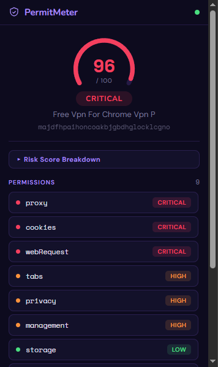

# PermitMeter
Browser extension risk scorecard for Chrome - Undergraduate Thesis

> 🇮🇩 [Baca dalam Bahasa Indonesia](#permitmeter--bahasa-indonesia)

A Chrome browser extension that performs real-time static analysis of Chrome Web Store extensions and generates a risk score (0-100) based on their declared permissions - **without installing the extension**.



---

## Features
- Risk scoring from 0-100 with color-coded bands (Safe / Medium / High / Critical)
- 5-tier severity system: None / Low / Medium / High / Critical
- Analyzes any Chrome Web Store extension **without installing it**
- Permission-level breakdown with plain-English descriptions and Chrome Docs links
- Host permission analysis with wildcard and exact-URL detection
- Risk Score Breakdown table - shows each permission's tier, weight, and contribution to the final score
- Analysis history - stores last 10 analyzed extensions, accessible via the clock icon
- Parse & render time displayed per analysis
- Fully client-side - no server, no data sent externally

---

## How It Works
When you open a Chrome Web Store extension page, PermitMeter detects the extension ID from the URL and downloads the `.crx` binary directly from Google's update server. It strips the CRX header (v2 and v3), parses the ZIP archive using a custom central-directory reader, and extracts `manifest.json`. The declared `permissions` and `host_permissions` are then scored using the product formula below - all locally in your browser, with no data leaving your machine.

---

## Risk Scoring Formula
```
Risk Score = 100 × (1 − ∏(1 − wᵢ))
```
Each permission is assigned a weight (`wᵢ`) based on its potential for harm:

| Tier | Weight | Example Permissions |
|----------|--------|---------------------|
| Critical | 0.45 | cookies, debugger, scripting, proxy, webRequest |
| High | 0.15 | tabs, history, nativeMessaging, desktopCapture |
| Medium | 0.10 | bookmarks, downloads, geolocation, browsingData |
| Low | 0.05 | activeTab, notifications, sidePanel |
| None | 0.00 | alarms, contextMenus, idle |

The product formula is used instead of a simple additive sum to prevent score saturation - each additional permission raises the score with diminishing returns, while still escalating toward 100 for high-risk combinations.

**Score bands:** 0-20 Safe · 21-40 Medium · 41-70 High · 71-100 Critical

---

## How to Install
1. Click the green **Code** button → **Download ZIP**
2. Unzip the downloaded file
3. Open Chrome → `chrome://extensions`
4. Enable **Developer Mode** (toggle, top right)
5. Click **Load unpacked** → select the `PermitMeter_crx` folder

---

## Built With
JavaScript · HTML · CSS · Chrome Manifest V3

---

## Limitations & Disclaimer
- PermitMeter evaluates **declared permissions only** - it does not analyze actual extension behavior, obfuscated scripts, or runtime activity.
- A low score does not guarantee an extension is safe; a high score does not guarantee it is malicious.
- Results are intended as a risk indicator to aid informed decision-making, not as a definitive security verdict.

---

## Academic Context
Developed as an undergraduate thesis project at **Universitas Bina Nusantara**, Cyber Security Program.
Thesis title: *"Perancangan dan Implementasi Alat Penilaian Risiko Sisi Klien untuk Izin Ekstensi Google Chrome"*

---

## License
MIT License © 2025 Christian Darren

---
---

# PermitMeter - Bahasa Indonesia
Scorecard risiko ekstensi browser untuk Chrome - Skripsi Sarjana

> 🇬🇧 [Read in English](#permitmeter)

Ekstensi browser Chrome yang melakukan analisis statis secara real-time terhadap ekstensi di Chrome Web Store dan menghasilkan skor risiko (0-100) berdasarkan izin yang dideklarasikan - **tanpa perlu menginstal ekstensi tersebut**.


---

## Fitur
- Penilaian risiko dari 0-100 dengan warna indikator (Aman / Sedang / Tinggi / Kritis)
- 5 tingkat keparahan: None / Low / Medium / High / Critical
- Menganalisis ekstensi Chrome Web Store **tanpa menginstalnya**
- Rincian per izin lengkap dengan deskripsi bahasa sehari-hari dan tautan ke Chrome Docs
- Analisis izin host dengan deteksi wildcard dan URL eksak
- Tabel Rincian Skor Risiko - menampilkan tier, bobot, dan kontribusi tiap izin terhadap skor akhir
- Riwayat analisis - menyimpan 10 ekstensi terakhir yang dianalisis, dapat diakses lewat ikon jam
- Waktu parse & render ditampilkan per analisis
- Sepenuhnya sisi klien - tanpa server, tanpa pengiriman data ke luar

---

## Cara Kerja
Saat kamu membuka halaman detail ekstensi di Chrome Web Store, PermitMeter mendeteksi ID ekstensi dari URL, lalu mengunduh file `.crx` langsung dari server pembaruan Google. File tersebut dibuka dengan membuang header CRX (v2 dan v3), lalu arsip ZIP di dalamnya diurai menggunakan parser custom berbasis central directory untuk mengekstrak `manifest.json`. Izin yang dideklarasikan dalam `permissions` dan `host_permissions` kemudian dihitung menggunakan rumus produk di bawah - semuanya dilakukan secara lokal di browser, tanpa data yang keluar dari perangkatmu.

---

## Rumus Penilaian Risiko
```
Skor Risiko = 100 × (1 − ∏(1 − wᵢ))
```
Setiap izin diberi bobot (`wᵢ`) berdasarkan potensi bahayanya:

| Tier | Bobot | Contoh Izin |
|----------|-------|-------------|
| Critical | 0.45 | cookies, debugger, scripting, proxy, webRequest |
| High | 0.15 | tabs, history, nativeMessaging, desktopCapture |
| Medium | 0.10 | bookmarks, downloads, geolocation, browsingData |
| Low | 0.05 | activeTab, notifications, sidePanel |
| None | 0.00 | alarms, contextMenus, idle |

Rumus produk digunakan sebagai pengganti penjumlahan biasa untuk menghindari saturasi skor - setiap izin tambahan menaikkan skor dengan imbal hasil yang semakin kecil, namun tetap mendekati 100 untuk kombinasi izin berisiko tinggi.

**Kategori skor:** 0-20 Aman · 21-40 Sedang · 41-70 Tinggi · 71-100 Kritis

---

## Cara Instalasi
1. Klik tombol hijau **Code** → **Download ZIP**
2. Ekstrak file yang diunduh
3. Buka Chrome → `chrome://extensions`
4. Aktifkan **Mode Pengembang** (toggle, kanan atas)
5. Klik **Load unpacked** → pilih folder `PermitMeter_crx`

---

## Dibangun Dengan
JavaScript · HTML · CSS · Chrome Manifest V3

---

## Keterbatasan & Disclaimer
- PermitMeter hanya mengevaluasi **izin yang dideklarasikan** - tidak menganalisis perilaku aktual ekstensi, skrip yang diobfuskasi, atau aktivitas saat runtime.
- Skor rendah bukan jaminan ekstensi aman; skor tinggi bukan berarti ekstensi pasti berbahaya.
- Hasil analisis dimaksudkan sebagai indikator risiko untuk membantu pengambilan keputusan, bukan sebagai kesimpulan keamanan yang definitif.

---

## Konteks Akademik
Dikembangkan sebagai proyek skripsi sarjana di **Universitas Bina Nusantara**, Program Studi Cyber Security.
Judul skripsi: *"Perancangan dan Implementasi Alat Penilaian Risiko Sisi Klien untuk Izin Ekstensi Google Chrome"*

---

## Lisensi
MIT License © 2025 Christian Darren
